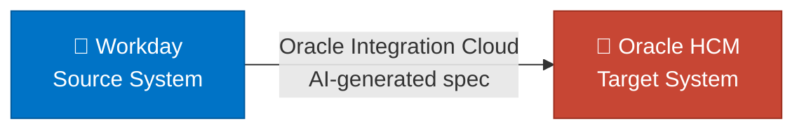
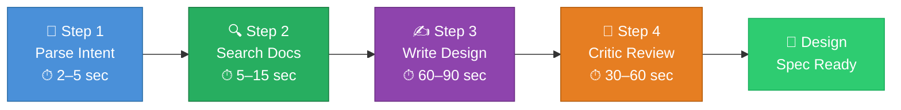

# Oracle Integration Copilot

A tool that turns a plain-English description of a business integration into a ready-to-review technical design — in seconds, not hours.

> Built for the Capgemini Oracle Cloud + AI engineering team as a demonstration of how AI can accelerate integration consulting work.

---

## Try It Yourself

No setup required. Open the link below, type an integration requirement, and click **Generate Spec**.

**[oracle-integration-copilot.streamlit.app](https://oracle-integration-copilot.streamlit.app/)**

Example requirements to try:
- *Sync new Workday hires to Oracle HCM every night at 2am. Skip contractors.*
- *When a Coupa purchase order is approved, create a matching order in Oracle ERP.*
- *Every night, sync Salesforce closed-won deals to Oracle ERP as invoices.*

---



---

## Acronyms

| Acronym | Full Form | What it means in plain English |
|---|---|---|
| OIC | Oracle Integration Cloud | Oracle's platform for connecting two business systems together |
| HCM | Human Capital Management | HR software — tracks employees, payroll, hiring |
| ERP | Enterprise Resource Planning | Finance & operations software — tracks invoices, purchase orders, suppliers |
| SCM | Supply Chain Management | Software that tracks inventory, items, and warehouse stock |
| API | Application Programming Interface | A way for two software systems to talk to each other over the internet |
| REST | Representational State Transfer | The most common style of API used today |
| JSON | JavaScript Object Notation | A simple text format for sending data between systems |
| LLM | Large Language Model | The AI engine (Claude) that reads and writes text |
| RAG | Retrieval-Augmented Generation | Giving the AI relevant reference documents before asking it to write |
| FAISS | Facebook AI Similarity Search | A tool that finds the most relevant documents from a large collection |
| OAuth | Open Authorization | A secure login method used between software systems |
| CLI | Command Line Interface | Running the tool by typing a command in the terminal |
| UI | User Interface | The visual app you interact with in a browser |
| SOAP | Simple Object Access Protocol | An older style of API, common in legacy enterprise systems |
| FTP | File Transfer Protocol | Moving files between systems over a network |
| PO | Purchase Order | A formal document a company sends to a supplier to request goods or services |
| AP | Accounts Payable | The team/system that manages money a company owes to suppliers |
| AR | Accounts Receivable | The team/system that manages money owed to a company by customers |

---

## What am I solving?

When a large company wants to connect two of its software systems — say, automatically moving new employee records from Workday into Oracle HCM — it needs an **integration**.

Designing that integration is currently a manual, time-consuming task. A consultant has to:

1. Read through Oracle's technical documentation to find the right API endpoints
2. Figure out which fields in System A map to which fields in System B
3. Design what happens when something goes wrong (a record fails, the connection drops)
4. Write all of this up in a design document before a single line of code is written

**That process takes 2–4 hours per integration — and companies need dozens of them.**

This tool cuts that down to under 2 minutes. You type what you need in plain English. The copilot reads the relevant Oracle documentation, figures out the right design, and hands you a complete draft spec.

**Why would a business invest in this?**

- **Faster first draft.** The repetitive parts of integration design — looking up API endpoints, writing mapping tables, structuring error handling — are done automatically. Consultants can focus their time on the decisions that actually need expertise.
- **Accuracy from the start.** The tool cross-references Oracle's own documentation before generating any design. This reduces the chance of a wrong endpoint or a missed field making it all the way to the development stage.
- **Consistent, reviewable output.** Every design follows the same structure — same sections, same level of detail — making reviews and handoffs predictable regardless of who ran the tool.
- **Problems surface earlier.** The built-in critic step flags assumptions and open questions before the first review meeting. This means the design conversation starts at a higher level, not at "wait, which auth method does this system use?"

---

## Tech Stack

| Layer | Tool | Role in this project |
|---|---|---|
| Web UI | Streamlit | Browser interface — text input, live spec rendering, download button |
| LLM | Anthropic Claude | Parses plain-English requirements, generates integration designs, runs the critic review pass |
| Vector database | FAISS | Stores and searches the 11 Oracle reference documents by meaning, not just keywords |
| RAG pipeline | LangChain | Splits documents into chunks, wraps the embedding model, and connects to FAISS |
| Embeddings | HuggingFace sentence-transformers | Converts text to vectors locally — no API cost, no rate limits |
| Schema validation | Pydantic | Enforces the data contract between every layer of the pipeline |
| Config | python-dotenv | Loads API keys and settings from `.env` without touching code |

---

## Data Sources

The tool has been pre-loaded with 11 reference documents written from Oracle's public documentation. Think of these as the tool's "textbook" — it reads the relevant chapters before answering your question.

| Document | What it covers |
|---|---|
| `oic_patterns.md` | The four ways systems can be connected in OIC |
| `hcm_rest_workers.md` | How to create and update employee records in Oracle HCM |
| `erp_rest_invoices.md` | How to create supplier invoices in Oracle ERP |
| `erp_rest_suppliers.md` | How to look up and create supplier records |
| `scm_rest_items.md` | How to manage product and inventory records in Oracle SCM |
| `oic_fault_handling.md` | What to do when something goes wrong mid-integration |
| `oic_connections.md` | How OIC connects to different types of systems |
| `oic_orchestration.md` | How to design the step-by-step logic of an integration |
| `oic_transformations.md` | How to convert data from one format to another |
| `oci_auth_oauth.md` | How systems prove their identity to each other securely |
| `oic_idempotency.md` | How to make sure running the integration twice doesn't create duplicate records |

It also has 3 worked examples — complete before-and-after designs — that help the AI understand what a good answer looks like:

- Workday new hires → Oracle HCM (nightly sync)
- Coupa approved purchase orders → Oracle ERP
- Salesforce closed deals → Oracle ERP invoices

---

## Workflow and Logic

Here is what happens from the moment you type your requirement to the moment you get a design spec:

```
You type a requirement in plain English
        │
        ▼
  ┌─────────────┐
  │   Parser    │  The AI reads your sentence and extracts the key facts:
  │             │  what type of integration, which systems, what to filter
  └─────────────┘
        │
        ▼
  ┌──────────────┐       ┌──────────────────────────┐
  │  Retriever   │◄─────►│ Document library          │
  │              │       │ (11 Oracle reference docs) │
  └──────────────┘       └──────────────────────────┘
        │  Finds the 6 most relevant pages from the library
        ▼
  ┌──────────────┐◄──── Loads 1–2 worked examples for guidance
  │   Designer   │
  │              │  The AI writes the full integration design
  │              │  using your requirement + the relevant docs
  └──────────────┘
        │
        ▼
  ┌──────────────┐
  │   Critic     │  A second AI pass reads the design and asks:
  │  (optional)  │  "What did we assume? What did we miss?"
  └──────────────┘
        │
        ▼
  ┌──────────────┐
  │   Renderer   │  Formats everything into a clean document
  │              │  with a diagram, mapping table, and sample data
  └──────────────┘
        │
        ▼
   Terminal output  OR  Browser UI with a download button
```

The **Critic** step is the most valuable part. A single AI pass tends to be overconfident — it fills in the gaps with guesses. The critic is prompted differently: "what is wrong or missing?" This surfaces things like *"we assumed the supplier already exists in Oracle — what if it doesn't?"* before a human engineer has to catch it in a review meeting.

---

## Result

Given this input:

> *"Every night at 2am, pull new hires from Workday and create employee records in Oracle HCM. Skip contractors. Send a Slack alert if any record fails."*

The tool produces a complete design document containing:

- **What type of integration to build** — a nightly scheduled sync, triggered at 2am
- **Where to get the data** — the exact Workday API endpoint to call, with the right filters
- **Where to send the data** — the exact Oracle HCM API endpoint, with a sample request
- **A field-by-field mapping table** — which field in Workday becomes which field in Oracle, and how to convert it
- **Error handling steps** — what happens when one record fails (it logs the error and sends a Slack message, then continues with the next record)
- **A list of things to verify** — assumptions the AI made that a human must check before building
- **A list of open questions** — things the requirement didn't specify, like what to do if the employee already exists
- **A diagram** showing the full flow from start to finish

---

## What happens after an intent is issued?



When you submit a requirement, the tool works through four steps in sequence. Each step is doing real, meaningful work — here is what is happening behind the scenes and why it takes the time it does.

**Step 1 — The AI reads your sentence (2–5 seconds)**
The tool sends your plain-English requirement to Claude, which reads it and pulls out the key facts: which systems are involved, what type of integration it is, what filters apply, and whether any notifications were mentioned. This comes back quickly because it is a focused, well-defined task.

**Step 2 — The document library is searched (5–15 seconds)**
The tool loads a pre-built index of 11 Oracle reference documents and searches for the pages most relevant to your requirement. It uses an AI embedding model to understand meaning — not just keywords — so it finds the right pages even if you used different words than the documentation does. On the very first run this model is loaded into memory, which takes a little longer. Every run after that it is already ready.

**Step 3 — The full design is written (60–90 seconds)**
This is where the heavy lifting happens. The tool gives Claude your intent, the 6 most relevant documentation pages, and 2 worked examples, then asks it to produce a complete integration design as a structured document. This includes endpoints, field mappings, error handling, sample payloads, and more. Generating a thorough, structured response of this size takes time — and that is a sign the output is detailed, not that something is wrong.

**Step 4 — A second review pass runs (30–60 seconds)**
A separate AI call reads the full design and asks a different question: "what did we assume, and what did we miss?" This critic pass is what adds the assumptions and open questions sections. It runs independently so it can catch things the first pass was too confident about.

> In a production deployment, steps 2–4 can be significantly optimised — the document index can be pre-loaded into memory at server startup, the design and critic calls can run with a higher API rate limit tier, and responses can be streamed token by token so the user sees output appearing in real time rather than waiting for the full result. The current version is a working prototype that prioritises correctness and completeness over speed.

---

## What each file does

A quick plain-English guide to the codebase for anyone reading it for the first time.

| File | What it does |
|---|---|
| `app.py` | Runs the browser interface. When you open the tool in your browser, this is the file that draws the page, takes your input, and shows you the result. |
| `copilot/schemas.py` | Defines the shape of the data the tool works with — what an "intent" looks like and what a "design spec" looks like. Every other file agrees to use these same shapes. |
| `copilot/config.py` | Reads your settings from the `.env` file — things like your API key and which AI model to use — and makes them available to the rest of the tool. |
| `copilot/ingest.py` | Reads all the Oracle reference documents, breaks them into small chunks, and builds a searchable index on disk. This only runs once; after that the index is reused. |
| `copilot/retriever.py` | Takes the key facts from your requirement and searches the document index for the most relevant pages. It finds pages by meaning, not just by matching words. |
| `copilot/parser.py` | Sends your plain-English requirement to the AI and asks it to pull out the structured facts — which systems, what schedule, what filters. If the AI's first answer is not quite right, it tries once more automatically. |
| `copilot/designer.py` | The main brain of the tool. It takes the structured facts, the relevant documentation pages, and some worked examples, then asks the AI to write a complete integration design. It also runs the critic step that checks the design for gaps. |
| `copilot/renderers/markdown.py` | Turns the finished design — which is just data at this point — into a nicely formatted document with a diagram, a mapping table, and sample data blocks. |
| `copilot/__main__.py` | The entry point for the terminal version of the tool. When you type `python -m copilot "..."`, this file is what runs first. |
| `copilot/prompts/parser.txt` | The instruction card the AI reads before parsing your requirement. Changing this file changes how the AI extracts information, without touching any Python code. |
| `copilot/prompts/designer.txt` | The instruction card the AI reads before writing the integration design. This is where the detail and quality of the output is shaped. |
| `copilot/prompts/critic.txt` | The instruction card for the second AI pass. It tells the AI to read the design critically and look for things that were assumed or left unanswered. |
| `tests/test_parser.py` | Automated checks that confirm the parser handles good input, bad input, and retry situations correctly — without needing to call the real AI. |
| `tests/test_retriever.py` | Automated checks that confirm the document search finds the right pages and builds the right search query from the intent. |
| `tests/test_schemas.py` | Automated checks that confirm the data shapes are enforced correctly — for example, that an invalid integration pattern is rejected. |

---

## Quickstart

```bash
git clone https://github.com/your-username/oracle-integration-copilot
cd oracle-integration-copilot

pip install -e ".[dev]"

cp .env.example .env
# Open .env and add your ANTHROPIC_API_KEY

python -m copilot "Sync new Workday hires to Oracle HCM every night at 2am. Skip contractors."
```

First run downloads the AI embedding model (~90 MB) and builds the document index. Every run after that loads from disk in under a second.

### Browser UI

```bash
streamlit run app.py
```

### Terminal flags

```bash
python -m copilot "Sync Coupa POs to Oracle ERP on approval" \
  --output spec.md \    # save to a file
  --no-critic \         # skip the critic step (faster)
  --k 8 \              # use 8 reference pages instead of 6
  --verbose             # show detailed logs
```

---

## Configuration

All settings go in your `.env` file:

| Setting | Default | What it does |
|---|---|---|
| `ANTHROPIC_API_KEY` | — | Your Claude API key (required) |
| `CLAUDE_MODEL` | `claude-sonnet-4-6` | Which Claude model to use |
| `EMBEDDING_MODEL` | `sentence-transformers/all-MiniLM-L6-v2` | Model used to search the document library |
| `FAISS_INDEX_PATH` | `data/index` | Where the document index is saved |
| `ORACLE_DOCS_PATH` | `data/oracle_docs` | Where the reference documents live |

---

## Running Tests

```bash
pytest
pytest --cov=copilot --cov-report=term-missing
```

---

## Limitations and Future Work

This tool produces a **design draft**, not production code. Important caveats:

- All Oracle API endpoints come from public documentation. Real environments have different hostnames, org codes, and field values that must be confirmed.
- It does not connect to a live Oracle system — everything is designed, not deployed.
- It works best for common integrations (HCM, ERP, SCM). Unusual Oracle modules will produce less accurate designs.

**What could come next:**
- A mode that sends the generated design directly into a real OIC environment to create a draft integration
- Support for older Oracle systems that use SOAP instead of REST
- An automated test that scores the quality of each generated design against the worked examples
